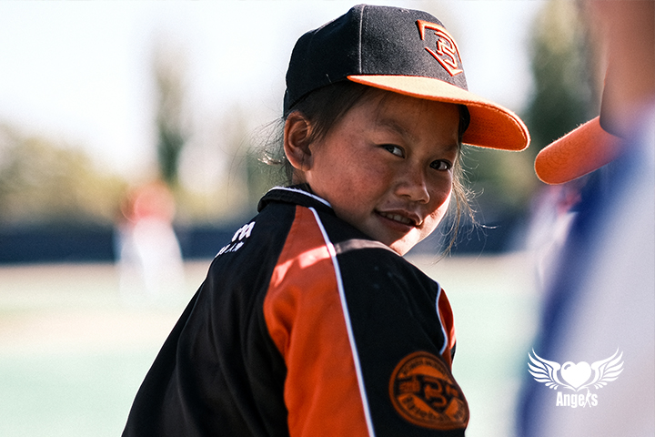
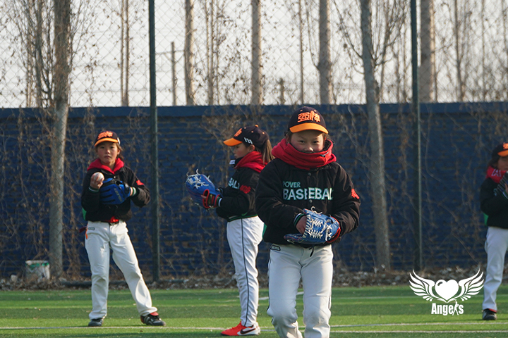
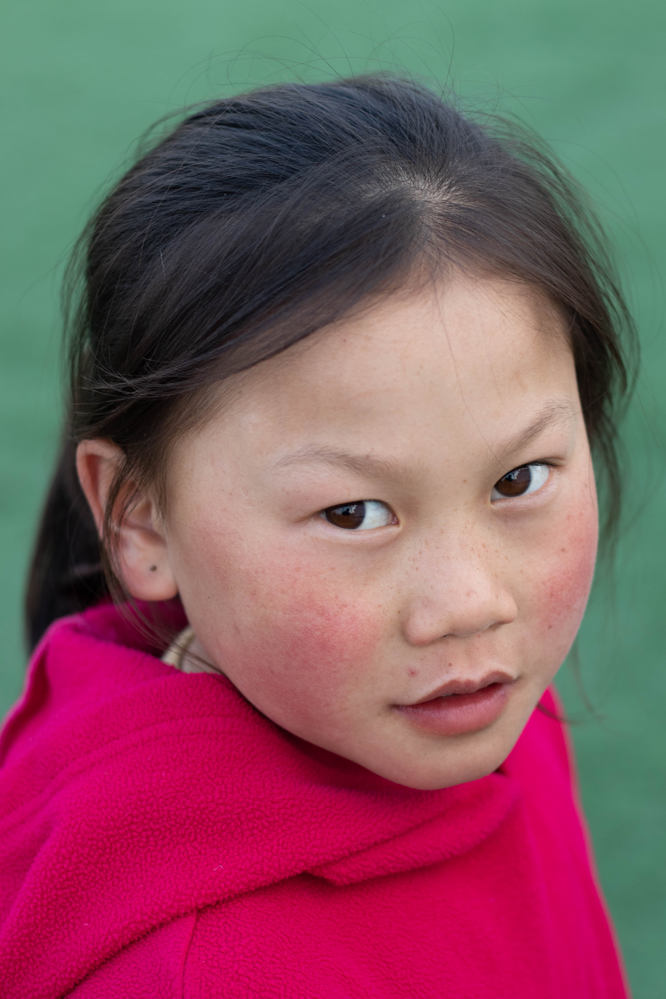

# 嗨，大家好，我是海来金里

 

> 这是我在强棒基地的照片

2012.8.17，我出生在四川凉山州，朋友们叫我 "**牛魔王**"，因为我常年扎两个"牛角"辫，活泼蹦跶起来的时候就像山中的精灵~  朋友们也说喜欢看我笑，很容易忍不住就跟着我一起嬉皮起来~

## 棒球之旅的开始

 

2020年9月，我加入了强棒基地并且学习棒球。

在强棒的学习很顺利，我印象中还没有遇到过困难（也许就是天选棒球少女~）

目前的棒球学习时间还比较短，还没有参加过比赛（值得期待~）

## 在强棒的一天

在强棒基地，我们除了训练棒球，也和其他普通学校的小朋友们一样进行学习，生活丰富多彩。

  * 上午：6点起床，学习语文和数学
  * 下午：14点到17点半之间进行棒球训练，大概3个小时左右的训练时长
  * 晚上：18点晚饭后，大家一起看新闻联播，之后写作业，写完作业就可以自由活动，21点回房间睡觉，22点熄灯

一天之中我最喜欢的时光是打棒球和看动画片，我也有很多其他的爱好，比如跳舞、打羽毛球。

## 关于未来

如果没有棒球，我不知道我的未来是什么样的，但是接触棒球后，我可以肯定的是：我想成为一名职业棒球选手。

希望这个理想可以实现!
