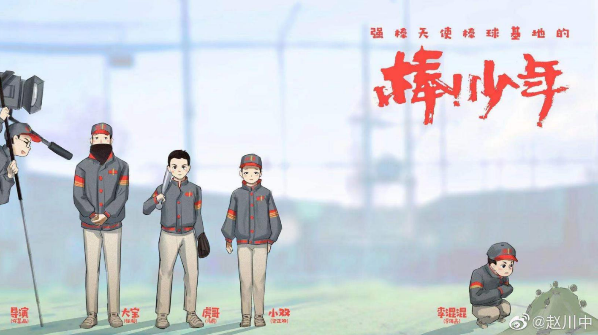
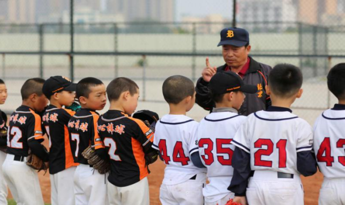
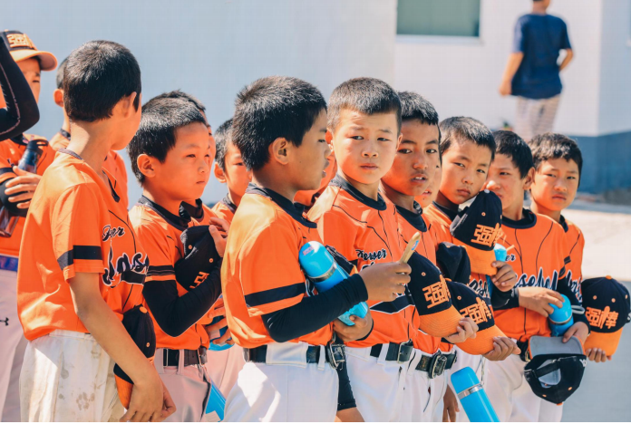
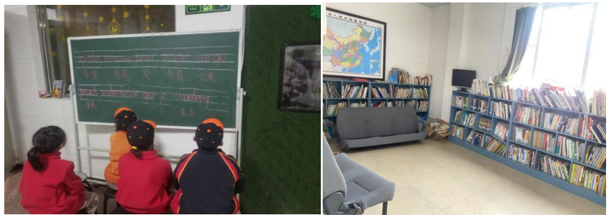
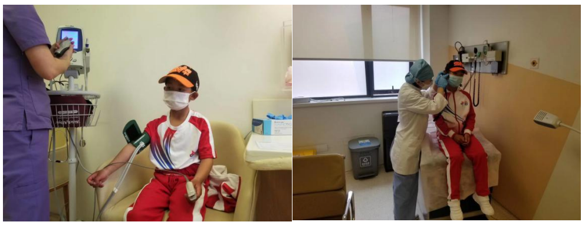
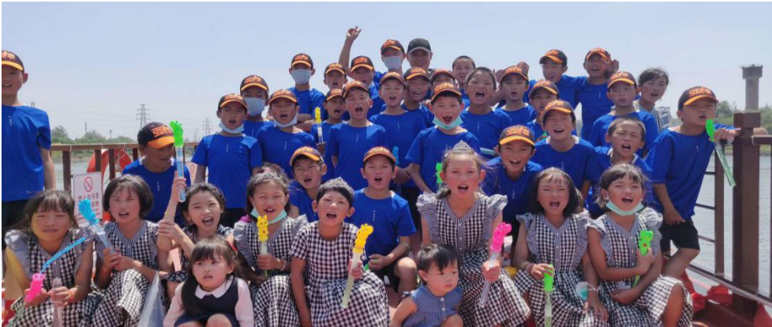
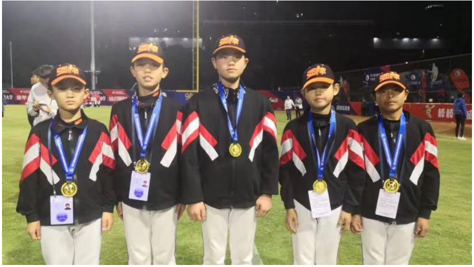

# 关于强棒天使项目

 

**强棒基地** 由前国家棒球队队长孙岭峰与爱心人士联合筹资建设，创建中国第一支公益棒球队。基地主要资助对象为全国范围内 7-10 岁困境儿童，通过专业的棒球技能获得职业发展方向和未来的就业机会。

>   * 2015 年 12月，孙岭峰与前中国棒球协会常务副主席李高潮、前中国棒球协会青少年委员会主任张锦新等爱心人士联合发起成立“强棒天使项目”，并在昌平区小汤山建设了“强棒天使爱心棒球基地”，开始创建第一支中国公益棒球队“强棒天使队”。
>   * 2019 年 12月，第一批女孩入驻强棒天使基地，至今已有26名女孩，最小的6岁，最大14岁。25个来自四川大凉山的彝族姑娘。她们分别组成了U10和U12年龄组，是中国第一支女子棒球队。
>   * 截至 2020 年11月，项目共资助困境儿童80名，其中女孩 26名，多数儿童来自四川大凉山彝族自治州。通过基地的学习训练，她们重拾了信心也对未来建立目标，部分孩子通过努力训练走向了更大的舞台，获得了更多人的关注和认可。

 
> 国宝级教练张锦新天天和孩子们在一起

## 资助对象

“强棒天使项目”主要资助对象为全国范围内7-9岁的困境儿童，以集中培训的形式，使被资助者以专业的棒球技能获得职业发展方向和未来的就业机会。
5年来，项目通过与各地政府机构、基层组织、民间团体的合作，走访了全国300个家庭，筛选出80余名困境儿童进行资助培训。目前有68名困境儿童在北京通州区漷县镇的“强棒天使棒球基地”参加集中培训。
他们分别来自全国9个地区，包括彝族等6个少数民族。其中男孩42名，女孩26名。年龄最小的7岁，最大的14岁，少数民族占75%。“强棒天使队”是一支名副其实的由困境儿童组成的多民族公益棒球队。

 

## 关于基地

基地除配有室外标准训练场及比赛场外，还配有厨房、餐厅、宿舍、浴室、学习室、图书室、活动室等多种功能设施。除保障正常的文化学习、训练及营养外，还有专人负责运动康复及日常医疗保障。

 
> 图书室和学习室

 
> 每年的例行体检
 
基地会定期组织各项主题活动，如春天去北京动物园春游、夏天去颐和园划船、秋天去天安门广场看升旗、冬天去庙会、去山区种树、参观博物馆、圣诞 party、集体观看各种演出，每月生日会、端午节包粽子等等，让孩子们在各种活动中增长见识，学习传统文化知识，获得更多认识世界的机会。

 
> “六一”儿童节坐船游大运河公园

## 成材计划

“强棒天使棒球队”将参加各种国内外知名赛事，随着年龄的增长并根据自身发展特点、参与比赛名次及文化学习成绩，队员会进入北京棒球传统校或职业高中进行学习，成绩优秀者还可进入知名大学继续深造。队员成年后，将会利用所学完成职业规
划。
  * 通过选拔输送到美国 MLB、韩国 KBO、日本 NPB 以及台湾CPBL 等世界顶级职业联盟打球，成为世界级棒球明星。
  * 进入中国国家棒球队及各省市专业队参加职业联赛。
  * 进入棒球培训体系成为一名棒球培训师，完成职业规划。

## 关于荣誉

1. 2017 年 7 月“强棒天使队”有 4 名孩子入选国家少年棒球队，奔赴日本代表中国参加著名国际青少年棒球赛事 PONY 杯，并荣获成长组冠军。

2. 2018 年 8 月，“强棒天使队”受到了来自 PONY 少棒联盟美国组委会的官方关注，作为亚太区的唯一一支代表队，球队受邀参加 2018 年 PONY 世界大赛 U11 Bronco 组决赛阶段的角逐，这是中国棒球历史上首次直接获邀代表亚太区参加国际青少年棒球赛事，刷新了中国体育的历史。赛事期间，球队在当地形成轰动性的影响，孩子们健康、阳光、坚强的动人事迹登上著名报纸《波士顿环球报》、《世界日报》、《侨报》等美国媒体。

3. 2019 年 12 月“强棒天使队”作为除了主办地深圳外的唯一一支球队，受邀参加了在深圳举行的“第三届海峡两岸学生棒球联赛”U10 组别的比赛，并获得该组别所有的个人单项奖。

 
